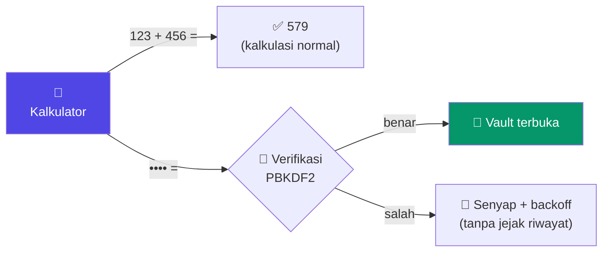
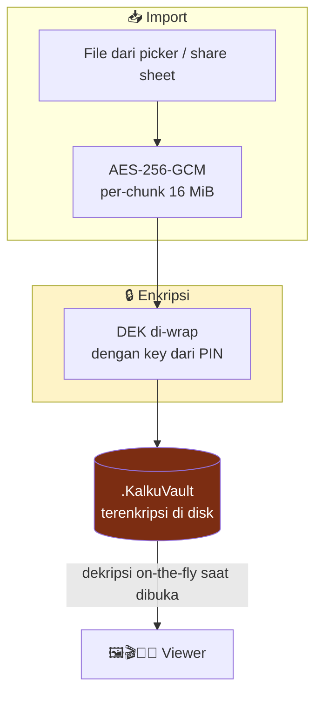

<div align="center">


# **Kalku**

### *Calculator outside. Vault inside. Everything local.*

[](https://github.com/az925-crypto/Kalku/actions/workflows/build.yml)


**Aplikasi penyimpanan file terenkripsi yang menyamar sebagai kalkulator ilmiah.**
Tanpa akun · Tanpa server · Tanpa kompromi privasi.

[Fitur](#-fitur) · [Keamanan](#-keamanan--privasi) · [Cara Pakai](#-mulai-cepat) · [Arsitektur](#-arsitektur) · [Build](#-build--ci)

</div>

---

## 🎬 Cara Kerja



Dan beginilah nasib setiap file yang masuk:



> [!IMPORTANT]
> Dari luar, Kalku adalah kalkulator scientific yang berfungsi penuh.
> Percobaan PIN yang salah dievaluasi senyap dan **tidak pernah** masuk riwayat.

---

## ✨ Fitur

### 🧮 Kalkulator Kamuflase

Bukan tampilan palsu — kalkulator yang benar-benar nyaman dipakai sehari-hari.

| | |
|---|---|
| ➕ **Basic** | Tambah, kurang, kali, bagi, persen, desimal, kurung, negatif |
| 📐 **Scientific** | sin/cos/tan + inverse, log/ln, akar, pangkat, faktorial, mod |
| π **Konstanta** | pi, e, notasi ilmiah, mode DEG/RAD |
| 🕘 **Riwayat** | Copy hasil, paste ekspresi, riwayat perhitungan |

### 🗝️ Unlock Tersembunyi

```
┌───┬───┬───┬───┐
│ • │ • │ • │ • │  ═══►  tekan  =  ═══►  📁 Vault
└───┴───┴───┴───┘
   PIN rahasia          satu tombol
```

Input lain apapun tetap diproses sebagai hitungan biasa. Tidak ada banner,
tidak ada notifikasi, tidak ada indikasi bahwa vault itu ada.

### 🔒 Enkripsi At-Rest

Setiap file dienkripsi **AES-256-GCM per-chunk (16 MiB)** dengan nonce unik
per chunk. Key derivation memakai **PBKDF2-SHA256** dari PIN kamu — plaintext
tidak pernah menyentuh disk.

```text
┌─────────┬─────────┬──────┬────────────┬────────────────────────────┐
│ KALKUENC│ version │ salt │ kdf params │ chunk │ chunk │ chunk │ … │
└─────────┴─────────┴──────┴────────────┴────────────────────────────┘
   magic      1 byte   16 B   JSON param   ct + 16 B GCM tag each
```

### 🗂️ File Manager Lengkap

Import (picker & share sheet) · Export/share · Folder baru · Rename · Copy ·
Move · Multi-select · Sort · Search universal · Grid & list view · ZIP ·
Recycle bin dengan restore / hapus permanen / auto-clean.

<details>
<summary><b>👁️ Viewer & Editor — klik untuk lihat semua</b></summary>

| Tipe | Kemampuan |
|------|-----------|
| 🖼️ **Foto** | Gallery grid, fullscreen, zoom, swipe antar foto, favorite, tag |
| 🎬 **Video** | Play/pause, seek, playback speed, fullscreen |
| 🎵 **Audio** | Playlist per kategori, loop, shuffle, speed |
| 📄 **PDF** | Render per halaman, zoom pinch, navigasi halaman, cache halaman |
| ✏️ **Teks/Kode** | Undo/redo, find & replace, line numbers, word count, syntax highlight ringan |
| 📦 **ZIP** | Lihat isi archive, extract |

</details>

### 🧠 Deteksi Pintar

Tipe file dikenali lewat ***magic bytes*** + extension — file tanpa extension
atau salah extension tetap masuk kategori yang benar.

### ⭐ Dashboard & Organisasi

Storage usage per kategori · Recent files · Favorites · Tags · Quick actions —
semua dalam satu layar buka vault.

---

## 🛡️ Keamanan & Privasi

| Layer | Mekanisme |
|-------|-----------|
| 🔑 **Akses vault** | PIN 4–16 digit, hash PBKDF2-SHA256 bersalt — tidak pernah plaintext |
| 🔐 **Enkripsi file** | AES-256-GCM per-chunk, DEK di-wrap ulang saat PIN berubah (atomic backup/recovery) |
| ⏱️ **Auto-lock** | Off / 1 / 5 / 15 menit + lock manual; seluruh layar vault ter-guard |
| 🐢 **Brute force** | Backoff progresif untuk PIN salah |
| 🌐 **Isolasi** | Nol izin internet · nol analitik · nol tracker · `allowBackup=false` |
| 💾 **Persistensi** | Vault di storage publik → file selamat dari uninstall/reinstall |

> [!CAUTION]
> **Lupa PIN = data tidak bisa dipulihkan.** Tidak ada backdoor, tidak ada
> reset — itu konsekuensi dari enkripsi yang benar. Simpan PIN-mu baik-baik.

> [!NOTE]
> Metadata (nama, ukuran, tag, favorit) tersimpan di database Room lokal.
> Hilang/rusak? **Settings → Rebuild index** memindai ulang seluruh vault dan
> membangun index dari nol.

---

## 🚀 Mulai Cepat

```text
1️⃣  Install APK
2️⃣  Buka app → muncul kalkulator biasa
3️⃣  Ketik  1234  lalu tekan  =
4️⃣  Buat PIN pribadi (sekali saja, wajib)
5️⃣  Import file → otomatis terenkripsi
6️⃣  Done. Hidupmu ada dua lapisan sekarang.
```

---

## 🏗️ Arsitektur

<details>
<summary><b>📂 Struktur modul — klik untuk expand</b></summary>

```text
com.zaaaam.kalku/
├── calc/           🧮 CalcViewModel + CalculatorScreen
├── core/
│   └── crypto/     🔐 ChunkedGcmCipher, VaultFileFormat, KeyMaterial
├── data/           🗄️ Room DB, entities, DAOs
├── fs/             📁 VaultRepo, DecryptedCacheManager,
│                      VaultCryptoStore, VaultEncryptionMigrator
├── nav/            🧭 Navigation graph
├── security/       🔑 LockController, CryptoSession
├── settings/       ⚙️ SettingsScreen
├── ui/             🎨 Theme, shared components
├── vault/          🖥️ Dashboard, browse, library screens
└── viewer/         👁️ Photo/video/audio/PDF/text/ZIP viewers
```

</details>

| Komponen | Teknologi |
|----------|-----------|
| UI | Jetpack Compose + Material 3 |
| Database | Room + KSP |
| Preferences | DataStore |
| Media | ExoPlayer (Media3) |
| Image | Coil |
| Crypto | AES-256-GCM + PBKDF2-SHA256 |
| Build | Gradle KTS + GitHub Actions |

---

## 🔨 Build & CI

Semua build lewat **GitHub Actions** — tidak butuh setup lokal apa pun.

| Trigger | Yang terjadi |
|---------|--------------|
| Push / PR ke `main` | Unit test → `assembleRelease` → APK ter-sign sebagai artifact |
| Push tag `v*` | APK dilampirkan otomatis ke **GitHub Release** |

<details>
<summary><b>🔧 Build manual (opsional)</b></summary>

```bash
gradle assembleRelease       # APK release
gradle testReleaseUnitTest   # unit test core logic
```

Signing release membaca env: `KEYSTORE_PATH`, `KEYSTORE_PASSWORD`,
`KEY_ALIAS`, `KEY_PASSWORD`. Tanpa itu, fallback ke debug signing.

</details>

---

## 📊 Spesifikasi

| | |
|---|---|
| 📦 Package | `com.zaaaam.kalku` |
| 🤖 Min SDK | 26 (Android 8.0+) |
| 🎯 Target SDK | 35 (Android 15) |
| 🏷️ Versi | 1.1.0 |
| 💻 Bahasa | Kotlin 100% |
| 🎨 UI | Jetpack Compose |

---

## 🗺️ Roadmap

<details open>
<summary><b>v1.2+</b></summary>

- [ ] Keystore-bound mode (wrap DEK dengan Android KeyStore)
- [ ] Syntax highlighting editor kode penuh
- [ ] Background audio playback (foreground service)
- [ ] Archive: extract selektif per-entry
- [ ] Biometric unlock sebagai metode tambahan
- [ ] i18n / string resource extraction

</details>

<details>
<summary><b>Ide backlog</b></summary>

- [ ] PDF annotation & highlight
- [ ] Markdown preview
- [ ] Image editor
- [ ] File versioning & duplicate detector
- [ ] Custom themes
- [ ] Wi-Fi transfer antar perangkat

</details>

---

<div align="center">

**Calculator outside. Vault inside. Everything local.**

*Hak milik pembuatnya — gunakan sesuai kebutuhan pribadi.*

Daftar fitur lengkap: [`fitur.txt`](fitur.txt)

</div>
